# Agent Workflow diagrams

This guide is a derived visual map of the Agent Workflow contract. The sole operational source is [`extensions/agent-workflow/workflow-fsm.ts`](../extensions/agent-workflow/workflow-fsm.ts); when a diagram and that FSM disagree, the FSM wins. Runtime gates live in [`workflow-machine.ts`](../extensions/agent-workflow/workflow-machine.ts). For an interactive diagram of the same transition table, open [`workflow-fsm.html`](../extensions/agent-workflow/workflow-fsm.html) after `npm run build:content`. The page is a diagram-only flat XState-style view: full FSM states and transitions in a machine frame, event/DO edge pills with optional CMD/ESC bundles, orthogonal routing, and double-click sidebar panels with full instruction bodies.

**Two layers:** persisted User modes are only Align / Spec / Vibe. The guided graph has seven steps composed by `modeBodies` with **roles**: `envision` (entry), primaries (`evaluate` / `explore` / `execute`), and secondaries (`establish` / `elaborate` / `examine`). Project permission is **read** (plan-state updates only) or **write** (project files); Align’s pre-ask rule is no extra file reads (harness-injected AGENTS.md only; no `.pi/plan` listing, README, package.json, or source exploration). After the first scope ask and `start`, Align may read the session plan then `.pi`. Only **secondary gates** CALL `next` (never the current mode). Spec/Vibe `next` lands on the target primary; Align is dual-landing — default `landing:"establish"` (editor standby, no auto-start) or `landing:"evaluate"` (D-review ask auto-start). Same-mode stay is ESC or Return to editor on the mode picker; `/mode` still lists all modes.

Read the layers in order to build a mental model: **Map → Modes → Machinery → Full picture**. Each view summarizes rules instead of duplicating the complete contract. Use the [coverage index](#source-symbol-coverage) to jump from an FSM symbol to its visual home.

Stable diagram ids (for anchors and downstream copies): `map-overview`, `ownership`, `modes-core`, `mode-align`, `mode-spec`, `mode-vibe`, `turn-spine`, `artifact`, `review`, `tools`, `handoff`, `full-turn`.

## L0 — Map

Start here. After this layer you should be able to say: three modes, one durable artifact, the User picks mode, only Vibe writes project files, and every turn captures then dispatches.

### map-overview — Session mental model

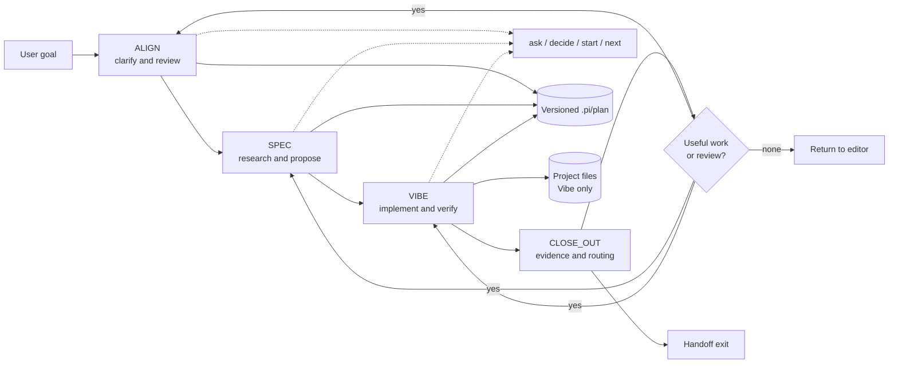

### ownership — Authority and tools

The User owns mode selection. The runtime owns UI and persistence mechanisms, while the Agent interprets the contract and owns the artifact's meaning. The Vibe-only project-write boundary is an Agent rule, not a filesystem sandbox.

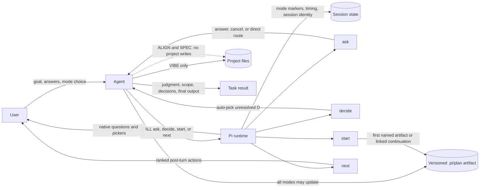

## L1 — Modes

Everyday mode hops and one procedure chart per mode. Continuity exits (handoff, fresh session, unrelated goal) live under Machinery → handoff.

### modes-core — Everyday mode lifecycle

Modes persist as User choices. New and handed-off interactive sessions enter Align; picker selections settle the current turn before a fresh target-mode turn begins.

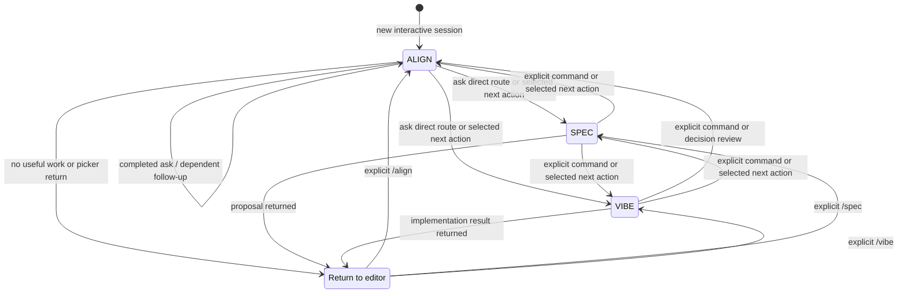

### mode-align — ALIGN procedure

**envision** runs once on session/handoff entry: no extra file reads → **`ask` ≥1 goal-scope** (before `start` when no named artifact) → `start`/reuse with a scope-informed slug (first write includes goal + scope) → then evaluate (or PWB Spec/Vibe; PWB with no plan: target `start` then synthesize). **evaluate** is the primary home (artifact check + later **`ask`** for D-review / User clarification / reconcile; ask-route to Spec/Vibe; no `next`). **establish** is the secondary gate only (`RETURN` to evaluate or **`next`/handoff** — never ask). Cancel discards the exchange, does not `start`, and does not open `next`.

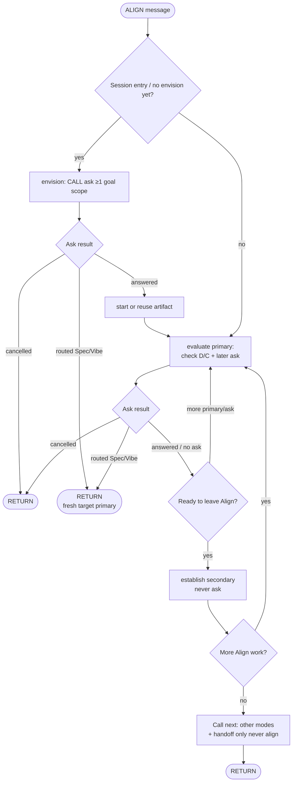

### mode-spec — SPEC procedure

**explore** is primary (research). **elaborate** is secondary (proposal, CLOSE_OUT, `next` or return to explore). `next` never includes Spec. Default Align recommendation is idle establish; add Align evaluate only when unresolved D ids need acceptance.

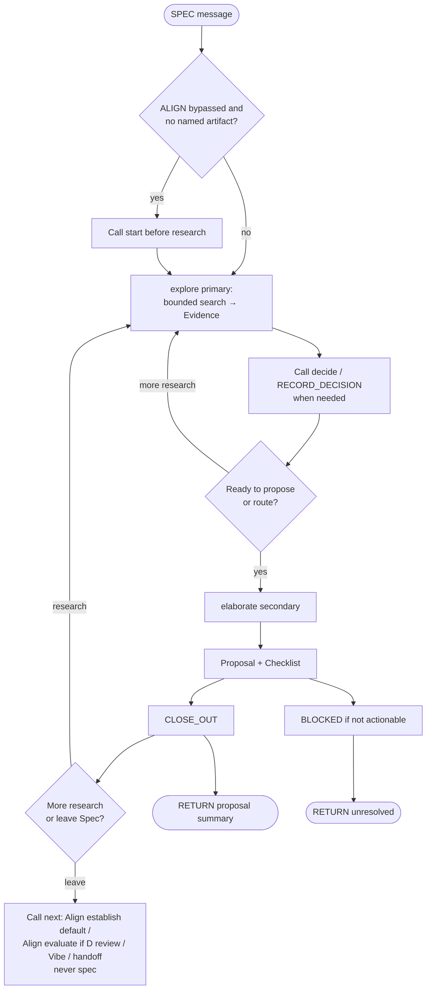

### mode-vibe — VIBE procedure

**execute** is primary (implement). **examine** is secondary (checks, CLOSE_OUT, `next` or return to execute). `next` never includes Vibe. Default Align recommendation is idle establish; add Align evaluate only when unresolved D ids need acceptance.

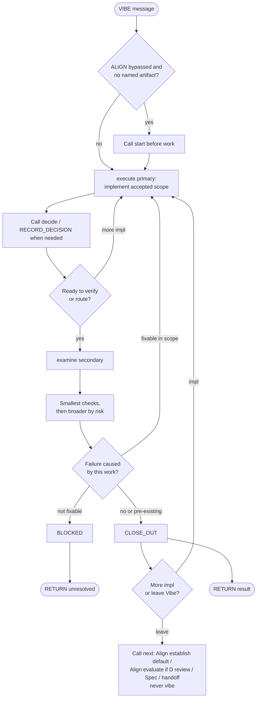

## L2 — Machinery

Shared systems after the mode story: turn spine, artifact, review, tools, and continuity.

### turn-spine — Shared turn control flow

Mode bodies are collapsed here; expand them in L1. Rejoin points are `BLOCKED`, `CLOSE_OUT`, and `next`.

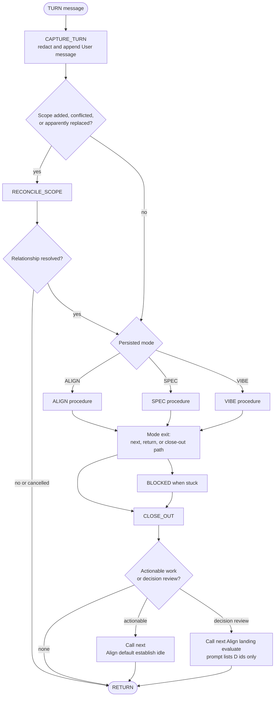

### artifact — Artifact model

The artifact is append-oriented, cumulative, and interpreted as a whole. Runtime does not parse free-form checklist or review status.

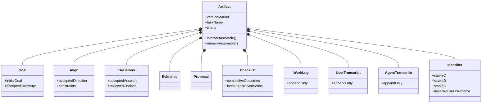

### review — Outcome and decision lifecycle

Checklist outcomes require evidence to complete. Agent decisions may be implemented while review remains unresolved, but only an explicit Align review answer makes them approved.

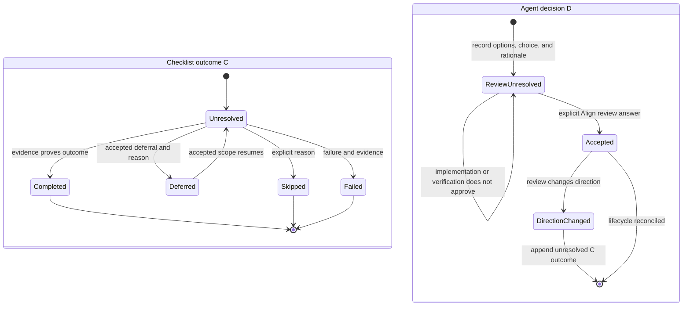

### tools — Tool and picker interaction

The tools provide mechanisms only. The Agent supplies semantic questions, artifact content, and contextual recommendations; runtime settles UI and prepends only mechanical transition context.

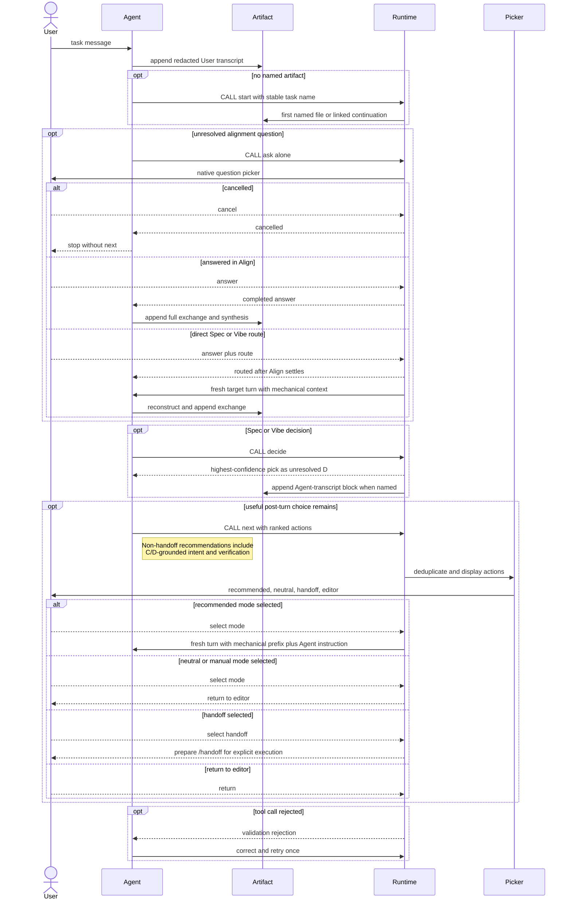

### handoff — Continuity, handoff, and legacy

Includes continuity edges kept out of `modes-core`: session swap after `/handoff`, fresh session after handoff, and genuinely unrelated goals. Current artifacts swap immediately onto the already-written file. Legacy artifacts remain immutable and convert only through a linked current-format continuation.

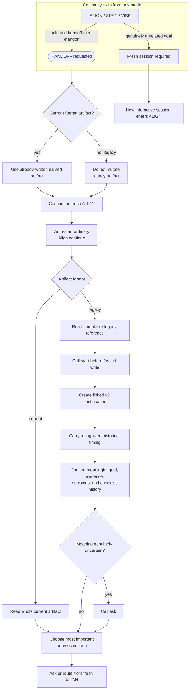

## L3 — Full picture

Synthesis only. Read this after L0–L2; it composes the spine and mode branches without adding new contract facts.

### full-turn — Composed turn dispatcher

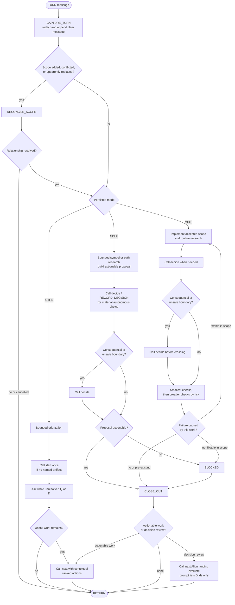

## Source-symbol coverage

- `modeBodies`, User modes align/spec/vibe: L0 `map-overview`, L1 `modes-core` / `mode-align` / `mode-spec` / `mode-vibe`; full guided graph in `workflow-fsm.html` / `toMermaid()`.
- Guided states `envision` … `evaluate`, `transitions` (including phase-end `NEXT_*`): interactive FSM HTML; L1 mode procedures summarize without listing every edge.
- `tools` (`start`/`ask`/`decide`/`next`), write-boundary `invariants`, project `permission` read|write: L0 `ownership`, L2 `tools`.
- `always` and source-of-truth rules: introduction, L0, and `workflow-fsm.ts` / `workflow-fsm.html`.
- `turn`, `CAPTURE_TURN`, `RECONCILE_SCOPE`, `WRITE_ARTIFACT`: L2 `turn-spine`, L2 `tools`, L3 `full-turn`.
- `artifact`, `RECORD_DECISION`: L2 `artifact` and `review`; decision gates also in L1 Spec/Vibe and L3.
- `BLOCKED`, `CLOSE_OUT`: L1 Spec/Vibe, L2 `turn-spine`, L3 `full-turn`; picker-ready close-out before L2 `handoff`.
- `HANDOFF`, `LEGACY_CONTINUATION`, continuity exits: L2 `handoff` (L0 shows handoff only as an exit node).
- `exceptions` (`/mode`, `/align`, `/spec`, `/vibe`, `/handoff`): L1 `modes-core`, L2 `handoff`, FSM exceptions block.

When changing a covered symbol, update the relevant view and rerun the Mermaid render checks alongside `npm run verify`.
